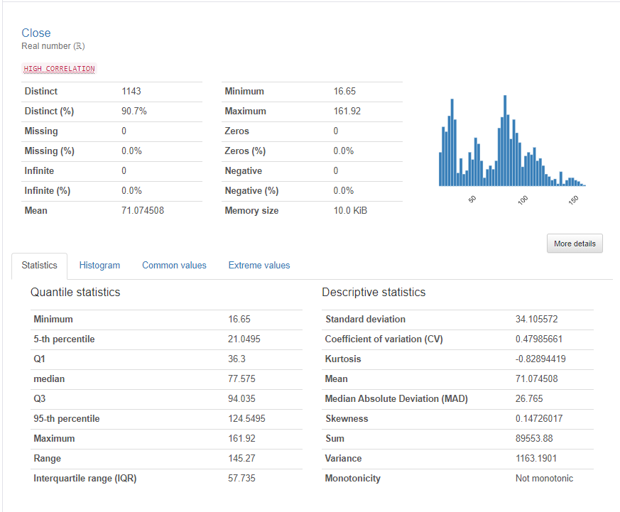
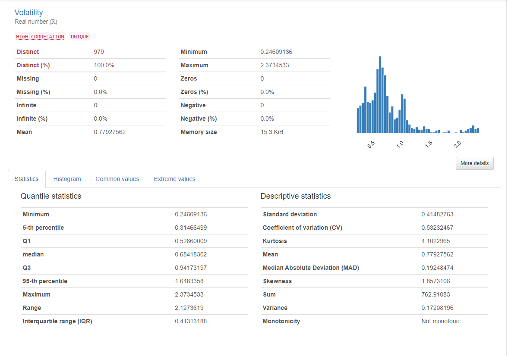
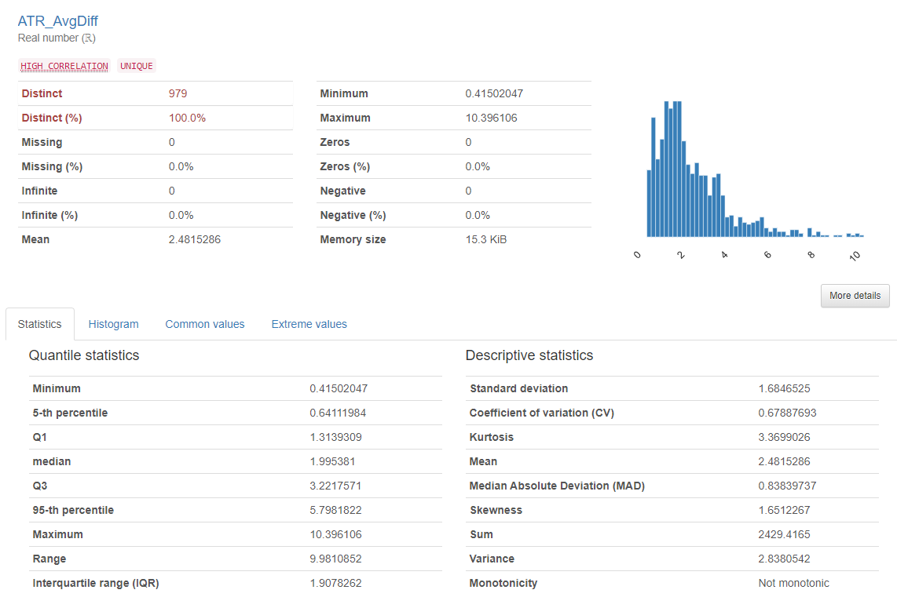
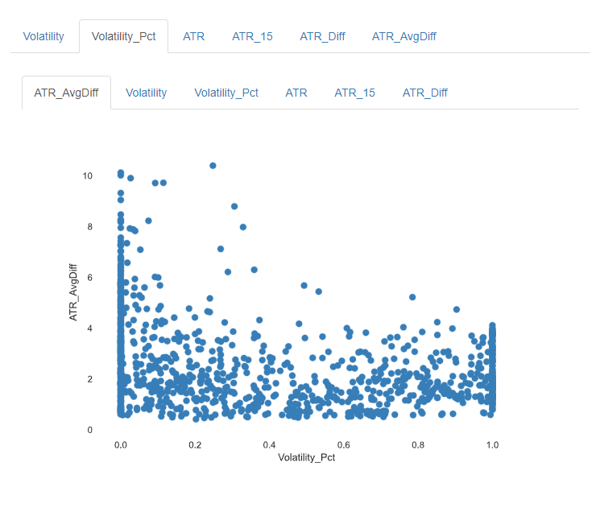

# Stock Trend Classifier / stock-env-classification

Simon Sayson

August 13, 2023

## Description

This program gets a stock's candlestick data and uses it as input to a classification model to predict how the stock will trend.

## Focus

This program was made with the intention to use it as a data framework for future projects as well as demonstrate some key skills. Main functionalities include data gathering, cleaning, and inspection, statistical analysis (descriptive and inferential), and example work of feature engineering and hypothesis testing.

## Table of Contents

- [Intro](#Intro)
- [Overview](#Overview)
- [Data Exploration and Preprocessing ](#Data-Exploration-and-Preprocessing )
- [Data Analysis](#Data-Analysis)
- [Machine Learning Model](#Machine-Learning-Model)
- [Results](#Results)
- [Potential Challenges](#Potential-Challenges)
- [Future Work](#Future-Work)
- [Details](#Details)
- [Potential Challenges](#Potential-Challenges)

## Intro

Hello! Ever since I was old enough to open my own brokerage account, algorithmic trading has piqued my interest. During my time in school, I embarked on several personal projects centered around algo trading and stock market analysis. This project is an improvement of my previous work, with a focus on data gathering and preparation. Through this project, I also aim to showcase fundamental skills like object-oriented programming, data analysis, Python coding, and machine learning techniques. Join me as I explore the world of data-driven trading strategies and bring insights to the ever-dynamic stock market.

## Overview


## Data Exploration and Preprocessing

> [!NOTE]
> For demonstration purposes, the stock data selected will be from the stock ticker 'AMD'.

### Sources and Data Characteristics
The primary sources of candlestick time-series data are yfinance's Python package and Alpha Vantage's API. The data I am choosing to extract are similar from both sources but must be formatted appropriately. All data will be primarily handled in the form of pandas data frames. An example of the data formatting, types, and characteristics are listed below:

**Both finance and Alpha Vantage's data have been transformed to this formatting:**

Data columns (total 6 columns):
```
 #   Column  Dtype  
---  ------  -----  
 0   Date    object 
 1   Open    float64
 2   High    float64
 3   Low     float64
 4   Close   float64
 5   Volume  int64  
```

 **Sample df:**
 ```
         Date   Open   High    Low  Close    Volume
0  2018-08-09  19.58  19.71  19.08  19.11  46653400
1  2018-08-10  19.10  19.48  18.86  19.06  65821100
2  2018-08-13  19.16  19.94  19.13  19.73  81411300
3  2018-08-14  19.97  20.29  19.63  20.03  89195500
4  2018-08-15  19.87  20.11  19.21  19.71  86355700
```

### Comparing and Validating Data
Due to the data sources being free and open source, inconsistencies and errors may occur. This is why 2 data sources are selected. Code snippets for the comparative method used are shown below:

(df1 -> yfinance data frame. df2 -> Alpha Vantage data frame)

**Check for similar df shape:**
```
        if df1.shape != df2.shape:
            print('Dataframe shapes do not match!')
            return False
```

**Compare each individual value between dfs using a tolerance:**
```
diff = np.abs(df1 - df2)
        max_tolerance = np.max(np.abs(df1) * tolerance)

        # Check if all values are similar within the tolerance
        are_similar = np.all(diff <= max_tolerance)
```

### Prepare Data
**Cleaning**
Several methods have been created to:
- Ensure that the data is the correct size
- Handle NaN/Null/Zero values. Either through filtering or basic imputation
- The df is not empty

**Splitting**
A basic train/test split function is included, along with an additional function that also splits features and labels.

**Scaling/Normalizing**
A minmax scalar function is included. Additional scaling and normalizing methods may be added in the future, depending on the specific models used.

### Features and Labels Used:

- 'Open', 'High', 'Low', 'Close' 'Volume'
 -  The initial data provided from our data sources.

- 'Volatility', 'Volatility_Pct', 'ATR',  'LogReturn', 'varLogReturn', 'stdLogReturn', 'Return', 'varReturn', 'stdReturn', 'NightGain', 'IntradayGain'
 - These are common volatility related features. These were selected based on the results from the inferential statistics testing done. ([Inference Statistics](#Inference-Statistics---Hypothesis-Test)
       
- 'ffd_adf_Open', 'ffd_adf_High', 'ffd_adf_Low','ffd_adf_Close', 'ffd_adf_Volume', 'ffd_adf_Return', 'ffd_adf_LogReturn', 'ffd_adf_NightGain', 'ffd_adf_IntradayGain', 'residual_Open', 'residual_High', 'residual_Low', 'residual_Close', 'residual_Volume'
 - Time series decomposition techniques added to some of the other features.
  - **Fixed-width window fractional differentiation:**  This method first checks to see if the series passes an ADF test at a p value of .05. If it passes, the df will be subjected to fractional differentiation using a fixed-width window. This is a practice that has been introduced by Marcos Lopez de Prado, a hedge fund manager known for his research in modern financial machine learning.
  - **Residual:** A decomposition of the original time series. Similar to time series 'noise'.
       
- 'Target'
 - The label data. 0 if the stock price trends down, 1 if the stock price is stagnant (future variability < current ATR) and 2 if the stock trends up.
 
## Data Analysis

Two main methods are added to analyze the data:

- get_pd_sumstats(): outputs the basic data frame description provided by pandas
- get_ydata_sumstats(): returns a comprehensive statistical report of the data. Uses the ydata_profiling python package, which is very useful for general statistical analysis including skewness/dispersion, summary statistics, variable interactions, and correlations.

### Primary Data Analysis
Using the ydata_profiling package, we can see some additional characteristics of the data:

**Summary Statistics of Closing Price:**



We can see some structure in price through the histogram visual. In this case, there is a rough bimodal distribution around 2 different price points. As this is only analyzing a portion (5 years) of the total time series data, the distribution of the stock might not be that significant.

As this type of time series data is also not stationary (industry assumption), most other basic summary statistics aren't that relevant.

### Inference Statistics - Hypothesis Test

Considering that volatility plays a significant role in sentiment, derivative pricing, and thus price action, I will be testing to see if there is a relationship between current volatility and future price action.

**Hypothesis:** The magnitude of the relative realized volatility affects the variability of future price action. 

**Initial Parameters/Definitions:**

> [!NOTE]
> For demonstration purposes, I will calculate observational features using a time window of 15 days.

- Magnitude of relative realized volatility: Simply the percentage of fluctuation of the current realized volatility when compared to the rolling range of realized volatility.
- Defining future variability: I'll use the common volatility metric ATR. Future variability will be defined as the average ratio of the future change in price and the current variability of the change in price. ( (future change in closing price) / (current ATR) )

**Summary Statistics of Hypothesis Test:**

Realized Volatility Statistics:



ATR Future Variability Statistics:



We can see there are some similarities in the skewness of the distributions.

**Results:**



It appears that there is no significant correlation between the relative magnitude of volatility and the future variability of price. One notable observation is that there seems to be a relationship where higher current volatility is associated with a decrease in future price variability. (NOTE: Point density at 0 and 1 is due to Volatility_Pct having lower lows or higher highs. Not that important as it is intended to be used as a demonstration.)

With that in mind, it may be important to add features relating to volatility.

## Machine Learning Model

**Model Selection:**
As this projects primary focus is data gathering, cleaning and analyzing, I'll select a commonly used classification algorithm such as SVMs. 

**Validation:**

A grid search kfold cross validation method will be used to validate the model during training.

## Results


## Potential Challenges
## Future Work
## Details
## Usage


