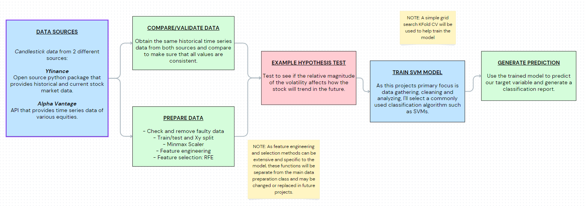

# Stock Trend Classifier / stock-env-classification

## Description:
This program gets a stock's candlestick data and uses it as input to a classification model to predict how the stock will trend.

## Focus:
This program was made with the intention to use it as a data framework for future projects as well as demonstrate some key skills. Main functionalities include data gathering, cleaning, and inspection, statistical analysis (descriptive and inferential), and example work of feature engineering and hypothesis testing.

## Table of Contents:
- [Intro](#Intro)
- [Overview](#Overview)
- [Data Exploration and Preprocessing ](#Data-Exploration-and-Preprocessing )
- [Data Analysis](#Data-Analysis)
- [Machine Learning Model](#Machine-Learning-Model)
- [Results](#Results)
- [Potential Challenges](#Potential-Challenges)
- [Future Work](#Future-Work)
- [Details](#Details)
- [Potential Challenges](#Potential-Challenges)

## Intro:
Hello! Ever since I was old enough to open my own brokerage account, algorithmic trading has piqued my interest. During my time in school, I embarked on several personal projects centered around algo trading and stock market analysis. This project is an improvement of my previous work, with a focus on data gathering and preparation. Through this project, I also aim to showcase fundamental skills like object-oriented programming, data analysis, Python coding, and machine learning techniques. Join me as I explore the world of data-driven trading strategies and bring insights to the ever-dynamic stock market.

## Overview:

## Data Exploration and Preprocessing 
## Data Analysis
## Machine Learning Model
## Results
## Potential Challenges
## Future Work
## Details
## Usage

