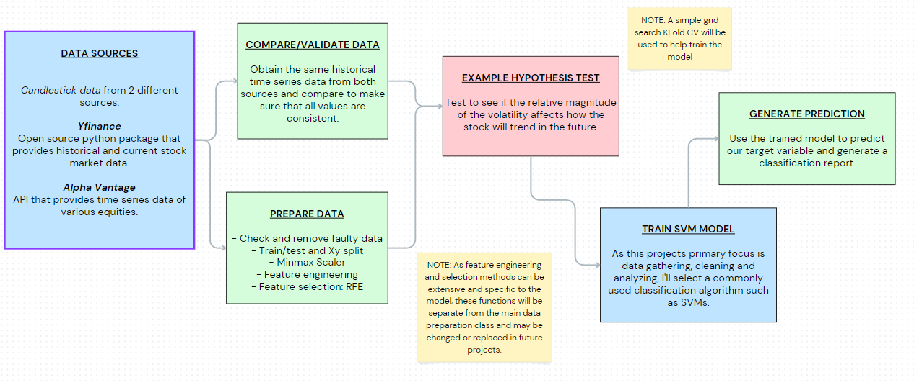

# Stock Trend Classifier / stock-env-classification

## Description:

This program gets a stock's candlestick data and uses it as input to a classification model to predict how the stock will trend.

## Focus:

This program was made with the intention to use it as a data framework for future projects as well as demonstrate some key skills. Main functionalities include data gathering, cleaning, and inspection, statistical analysis (descriptive and inferential), and example work of feature engineering and hypothesis testing.

## Table of Contents:

- [Intro](#Intro)
- [Overview](#Overview)
- [Data Exploration and Preprocessing ](#Data-Exploration-and-Preprocessing )
- [Data Analysis](#Data-Analysis)
- [Machine Learning Model](#Machine-Learning-Model)
- [Results](#Results)
- [Potential Challenges](#Potential-Challenges)
- [Future Work](#Future-Work)
- [Details](#Details)
- [Potential Challenges](#Potential-Challenges)

## Intro:

Hello! Ever since I was old enough to open my own brokerage account, algorithmic trading has piqued my interest. During my time in school, I embarked on several personal projects centered around algo trading and stock market analysis. This project is an improvement of my previous work, with a focus on data gathering and preparation. Through this project, I also aim to showcase fundamental skills like object-oriented programming, data analysis, Python coding, and machine learning techniques. Join me as I explore the world of data-driven trading strategies and bring insights to the ever-dynamic stock market.

## Overview:

## Data Exploration and Preprocessing:

### Sources and Data Characteristics
The primary sources of candlestick time-series data are yfinance's Python package and Alpha Vantage's API. The data I am choosing to extract are similar from both sources but must be formatted appropriately. All data will be primarily handled in the form of pandas data frames. An example of the data formatting, types, and characteristics are listed below:

**Both finance and Alpha Vantage's data have been transformed to this formatting:**
Data columns (total 6 columns):
 #   Column  Dtype  
---  ------  -----  
 0   Date    object 
 1   Open    float64
 2   High    float64
 3   Low     float64
 4   Close   float64
 5   Volume  int64  

 **Sample df:**
 
         Date   Open   High    Low  Close    Volume
0  2018-08-09  19.58  19.71  19.08  19.11  46653400
1  2018-08-10  19.10  19.48  18.86  19.06  65821100
2  2018-08-13  19.16  19.94  19.13  19.73  81411300
3  2018-08-14  19.97  20.29  19.63  20.03  89195500
4  2018-08-15  19.87  20.11  19.21  19.71  86355700

### Comparing and Validating Data
Due to the data sources being free and open source, inconsistencies and errors may occur. This is why 2 data sources are selected. Code snippets for the comparative method used are shown below:

(df1 -> yfinance data frame. df2 -> Alpha Vantage data frame)
**Check for similar df shape:**
'''
        if df1.shape != df2.shape:
            print('Dataframe shapes do not match!')
            return False
'''

**Compare each individual value between dfs using a tolerance:**
 '''
diff = np.abs(df1 - df2)
        max_tolerance = np.max(np.abs(df1) * tolerance)

        # Check if all values are similar within the tolerance
        are_similar = np.all(diff <= max_tolerance)
 '''

### Prepare Data
**Cleaning**
Several methods have been created to:
- Ensure that the data is the correct size
- Handle NaN/Null/Zero values. Either through filtering or basic imputation
- The df is not empty

**Splitting**
A basic train/test split function is included, along with an additional function that also splits features and labels.

**Scaling/Normalizing**
A minmax scalar function is included. Additional scaling and normalizing methods may be added in the future, depending on the specific models used.
 
## Data Analysis:

Two main methods are added to analyze the data:
- get_pd_sumstats(): outputs the basic data frame description provided by pandas
- get_ydata_sumstats(): returns a comprehensive statistical report of the data. Uses the ydata_profiling python package, which is very useful for general statistical analysis including skewness/dispersion, summary statistics, variable interactions, and correlations.

### Primary Data Analysis
A 

## Machine Learning Model:
## Results:
## Potential Challenges:
## Future Work:
## Details:
## Usage:

